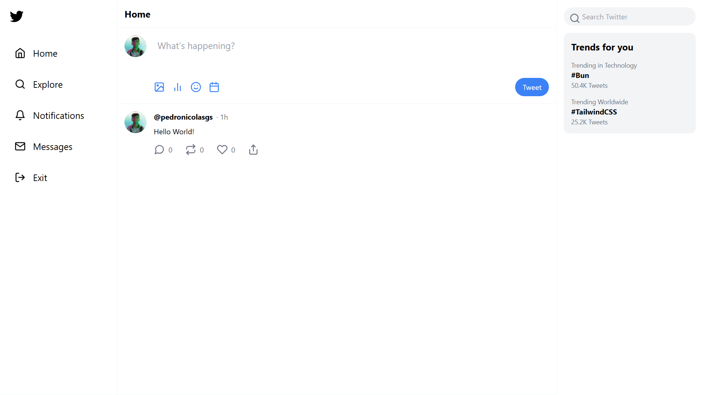
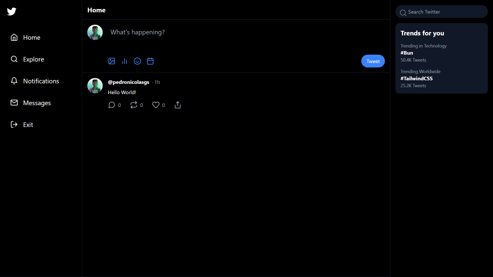

# Twitter Clone
A simple Twitter clone created for learning and demonstration purposes.

## 📸 Preview

## 🚀 Features
- User registration and login
- Tweet posting
- Display of a timeline with the most recent tweets
- Responsive UI with light & dark themes

## 🛠️ Technologies Used

## 🤝 Contributing
Contributions are welcome! Feel free to open an issue or submit a pull request with improvements or fixes.
